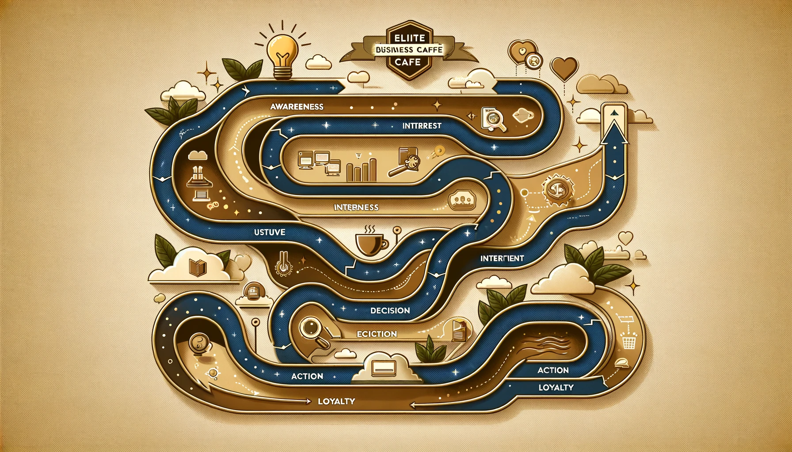

# Customer Journey for Elite Business Café

## 1. Awareness
- **Emotional Response**: Curiosity, interest.
- **Actions**: Encounter advertising, hear about the café.
- **Experience Rating**: Positive.
- **Methods of Persuasion**: Authority, Social Proof.

## 2. Interest
- **Emotional Response**: Intrigue, desire for exclusivity.
- **Actions**: Visit website, read about offerings.
- **Experience Rating**: Positive.
- **Methods of Persuasion**: Liking, Scarcity.

## 3. Decision
- **Emotional Response**: Excitement, anticipation.
- **Actions**: Make a reservation online.
- **Experience Rating**: Positive.
- **Methods of Persuasion**: Commitment, Reciprocity.

## 4. Action
- **Emotional Response**: Satisfaction, validation.
- **Actions**: Visit café, experience service.
- **Experience Rating**: Highly positive.
- **Methods of Persuasion**: Authority, Consistency.

## 5. Loyalty
- **Emotional Response**: Belonging, pride.
- **Actions**: Become a regular, recommend to peers.
- **Experience Rating**: Positive.
- **Methods of Persuasion**: Consensus, Reciprocity.

