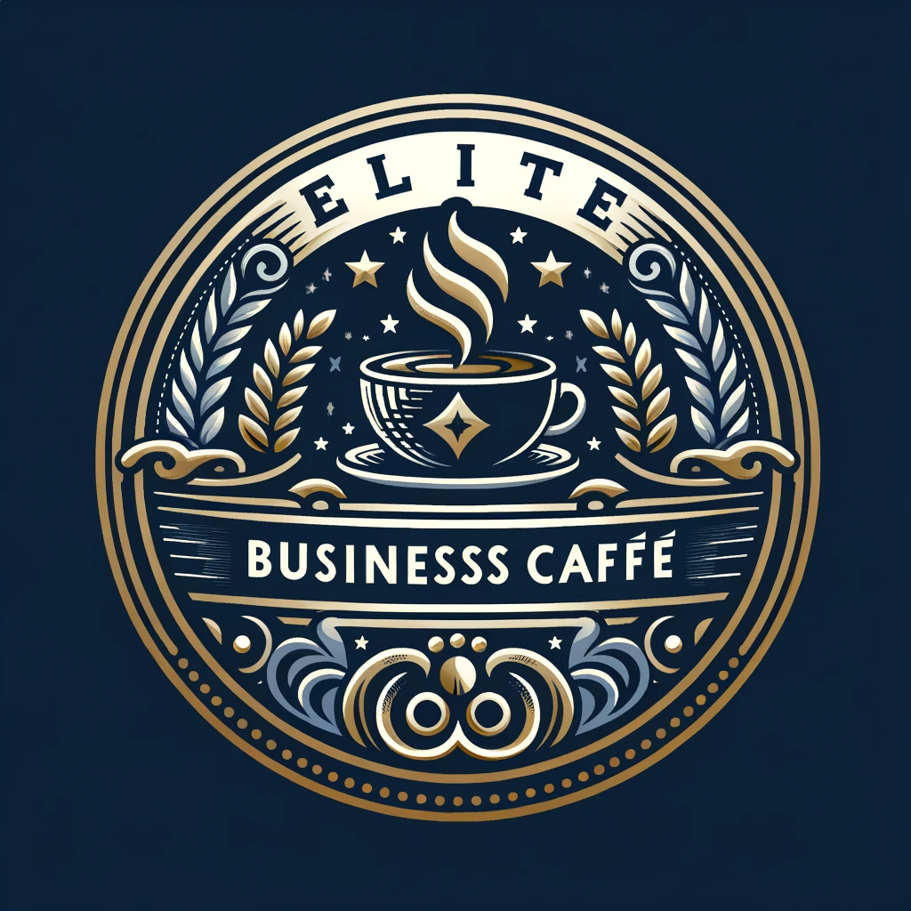

# Business Plan for Elite Business Café

## Executive Summary
Elite Business Café is a specialty coffee shop designed specifically for affluent business professionals, such as salespeople, lawyers, and executives. It focuses on providing an exclusive atmosphere conducive to business meetings and deal closures, along with high-quality specialty coffee and a premium service experience.

## Business Model Canvas

### Key Partners
- Local coffee bean suppliers
- High-end interior designers
- Business organizations and networking groups

### Key Activities
- Sourcing and brewing specialty coffee
- Providing a comfortable and private space for business meetings
- Hosting networking events and coffee tasting sessions

### Value Propositions
- A sophisticated environment tailored for business discussions and networking
- Premium quality coffee and a curated menu for discerning tastes
- Privacy and exclusivity for conducting business deals

### Customer Relationships
- Personalized service catering to the needs of business professionals
- Loyalty programs for frequent visitors
- Hosting exclusive events for members

### Customer Segments
- Business executives and professionals
- Salespeople looking for a space to meet with clients
- Lawyers and consultants

### Key Resources
- A well-located, elegantly designed café space
- Trained baristas and staff specializing in customer service for professionals
- High-quality coffee brewing equipment

### Channels
- The café location itself
- Website and online reservation system
- Social media platforms for marketing and community engagement

### Cost Structure
- Lease and maintenance of the café space
- Salaries for staff
- Purchasing high-quality coffee beans and equipment

### Revenue Streams
- Sales of coffee and food items
- Membership fees for exclusive services and events
- Hosting private business events and meetings

## Market Analysis
### Target Market
Affluent business professionals seeking a premium café experience and a space conducive to professional meetings and networking.

### Competitive Analysis
Comparative research will be conducted on local coffee shops and business lounges to identify gaps in services and opportunities for differentiation.

## Marketing Strategy
Utilizing a mix of digital marketing, networking events, and partnerships with local business organizations to reach the target audience.

## Operational Plan
The café will operate seven days a week, with extended hours to accommodate business schedules. Staff will be trained in both coffee expertise and understanding the unique needs of a business clientele.

## Financial Plan
A detailed financial plan will include startup costs, projected revenues, and a break-even analysis. Funding will be sought through business loans and potential investors.

## Images
- A conceptual design of the café interior
- Brand logo and imagery associated with the café
- Photos of specialty coffee and menu items

---
This business plan is a conceptual document for Elite Business Café, a specialty coffee shop designed for business professionals.
